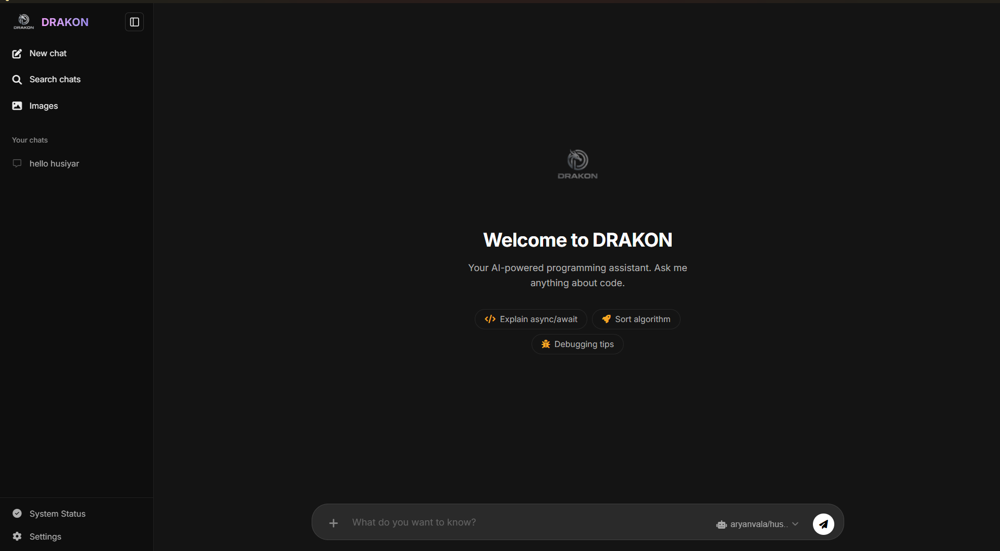

<p align="center">
  
</p>

<h1 align="center">DRAKON AI — User Manual</h1>
<p align="center"><em>Your Private, Offline-First AI Coding Assistant</em></p>

---

## 📑 Table of Contents

| # | Section |
|---|---------|
| 1 | [System Requirements](#1--system-requirements) |
| 2 | [Hosted Version (Web)](#2--hosted-version-web) |
| 3 | [Download & Launch the App](#3--download--launch-the-app) |
| 4 | [Install the Ollama Engine](#4--install-the-ollama-engine) |
| 5 | [Download Your First AI Model](#5--download-your-first-ai-model) |
| 6 | [App Interface Overview](#6--app-interface-overview) |
| 7 | [Core Features](#7--core-features) |
| 8 | [Managing Models](#8--managing-models) |
| 9 | [Keyboard Shortcuts](#9--keyboard-shortcuts) |
| 10 | [Troubleshooting](#10--troubleshooting) |


---

## 1 — System Requirements

| Component | Minimum | Recommended |
|-----------|---------|-------------|
| **OS** | Windows 10 (64-bit) | Windows 11 |
| **CPU** | Any modern quad-core | Intel i5 / Ryzen 5 or better |
| **RAM** | 8 GB | 16 GB or more |
| **GPU** | Not required (CPU-only mode) | NVIDIA GPU with 6 GB+ VRAM (CUDA) |
| **Disk Space** | 8 GB free | 15 GB+ free |
| **Internet** | Required for initial setup only | — |

> **Note:** After you download the app and model, DRAKON works **100% offline**. Your data never leaves your machine.

---

## 2 — Hosted Version (Web)

DRAKON is also available as a **hosted web application** — no download required! You can access the full interface directly in your browser.

🌐 **Live App:** [https://demodrago40-cell.github.io/DRAKON-Prompt/](https://demodrago40-cell.github.io/DRAKON-Prompt/)

> **Note:** The hosted version connects to cloud-based models. For full offline and local model support, use the desktop app (see sections below).

---

## 3 — Download & Launch the App

### Step 1: Get the Installer
Download `DRAKON.exe` from the official DRAKON download page or from the link provided by the team.

### Step 2: Place the File
Move `DRAKON.exe` into a dedicated folder. Recommended locations:
```
C:\Program Files\Drakon\
```
or simply keep it on your **Desktop**.

### Step 3: Run the App
Double-click `DRAKON.exe` to launch.

> **Windows SmartScreen Warning:**  
> If you see *"Windows protected your PC"*, click **More info** → **Run anyway**.  
> This is normal for newly distributed software and is completely safe.

Once launched, DRAKON will open a browser window at `http://127.0.0.1:5000` with the full chat interface.

---

## 4 — Install the Ollama Engine

DRAKON uses **Ollama** as its local inference engine — this is the "brain" that actually runs the AI models on your hardware.

### Step 1: Download Ollama
Go to the official download page:

🔗 **[https://ollama.com/download](https://ollama.com/download)**

Click the **Windows** button and download `OllamaSetup.exe`.

### Step 2: Install
Run the installer and follow the on-screen prompts. No special configuration is needed — the defaults work perfectly.

### Step 3: Verify Installation
After installation, Ollama runs silently in the background. Look for the **llama icon** 🦙 in the Windows **System Tray** (bottom-right corner, near the clock).

✅ If you see the icon → Ollama is running and ready.

> **Tip:** Ollama starts automatically with Windows. You don't need to launch it manually each time.

---

## 5 — Download Your First AI Model

DRAKON is optimized for a custom model called **Hushiyar-Alpha**, created by [Aryan Vala](https://github.com/devbyaryanvala) and built specifically for high-quality code generation and reasoning.

### Step 1: Open Terminal
Press `Win + R`, type `cmd`, and press **Enter** (or search for **PowerShell** in the Start Menu).

### Step 2: Pull the Model
Copy and paste this command into your terminal:

```bash
ollama pull aryanvala/hushiyar-alpha:latest
```

Wait for the download to complete. The progress bar will show the download status:

```
pulling manifest...
pulling abc123def456... 100% ██████████████████████ 4.7 GB
verifying sha256 digest...
writing manifest...
success
```

### Step 3: Verify It Works
Test the model directly in the terminal:

```bash
ollama run aryanvala/hushiyar-alpha:latest
```

Type a test message like `Hello!` and wait for a response. Once confirmed, type `/bye` to exit.

✅ The model is now permanently saved on your PC and ready for DRAKON to use.

### Optional: Other Compatible Models
You can also download other open-source models. Some popular choices:

| Command | Model | Size |
|---------|-------|------|
| `ollama pull llama3.1` | Meta Llama 3.1 (8B) | ~4.7 GB |
| `ollama pull mistral` | Mistral 7B | ~4.1 GB |
| `ollama pull codellama` | Code Llama (7B) | ~3.8 GB |
| `ollama pull gemma2` | Google Gemma 2 | ~5.4 GB |
| `ollama pull llava` | LLaVA (Vision Model) | ~4.5 GB |

> All downloaded models will automatically appear in DRAKON's model selector.

---

## 6 — App Interface Overview

When you launch DRAKON, you'll see the main chat interface:

<p align="center">
  
</p>

| Element | Description |
|---------|-------------|
| **Sidebar (☰)** | View, search, and manage your chat history |
| **Chat Area** | Main conversation window with AI responses |
| **Input Box** | Type your message or paste code here |
| **+ Button** | Access file uploads, Deep Think mode, and Image Generation |
| **Model Selector** | Switch between downloaded local models (bottom-right) |
| **Send Button (➤)** | Send your message (or press `Enter`) |

---

## 7 — Core Features

### 💬 Chat & Code Generation
Type any coding question or request in natural language. DRAKON will respond with structured, well-commented code.

**Example prompts:**
- *"Write a Python function to merge two sorted lists"*
- *"Explain what this error means: IndexError: list index out of range"*
- *"Convert this JavaScript function to TypeScript"*

### 📎 File Upload & Analysis
Click the **+** button next to the input box to attach files. Supported formats:

| Type | Extensions |
|------|-----------|
| Documents | `.pdf`, `.docx`, `.txt` |
| Code Files | `.py`, `.js`, `.html`, `.css`, `.java`, `.cpp`, etc. |
| Images | `.png`, `.jpg`, `.jpeg` (requires a vision-capable model like `llava`) |

DRAKON extracts the full text from your files and analyzes them intelligently. You can ask questions like:
- *"Summarize this PDF"*
- *"Find bugs in the attached Python file"*
- *"What does this code do?"*

### 🧠 Deep Think Mode
Activate via the **+** menu. In this mode, DRAKON takes extra time to reason through complex problems step-by-step before giving a final answer. Best for:
- Algorithm design
- Architecture decisions
- Debugging complex logic

### 🎨 Image Generation
Activate via the **+** menu. Generate images from text prompts using a local ComfyUI backend (requires separate ComfyUI installation).

---

## 8 — Managing Models

### View Installed Models
Open your terminal and run:
```bash
ollama list
```
This shows all downloaded models with their sizes:
```
NAME                          SIZE     MODIFIED
aryanvala/hushiyar-alpha:latest      4.7 GB   2 hours ago
llama3.1:latest               4.7 GB   1 day ago
```

### Switch Models in DRAKON
Click the **model name** displayed at the bottom-right of the chat interface. A dropdown will appear listing all available local models. Click any model to switch to it instantly.

### Update a Model
```bash
ollama pull aryanvala/hushiyar-alpha:latest
```
Running the same pull command again will download only the changed layers — fast and efficient.

### Remove a Model
```bash
ollama rm aryanvala/hushiyar-alpha:latest
```

---

## 9 — Keyboard Shortcuts

| Shortcut | Action |
|----------|--------|
| `Enter` | Send message |
| `Shift + Enter` | New line (without sending) |
| `Ctrl + N` | Start a new chat |

---

## 10 — Troubleshooting

### "Ollama Not Running" in Model Selector
**Cause:** The Ollama engine is not active.  
**Fix:**
1. Search for **Ollama** in your Windows Start Menu and click it.
2. Confirm the 🦙 icon appears in the System Tray.
3. Refresh the DRAKON page.

### Model Responses Are Very Slow
**Cause:** Running without a GPU. Ollama falls back to CPU-only inference, which is much slower.  
**Fix:**
- Close other memory-heavy applications (browsers, games, IDEs).
- If you have an NVIDIA GPU, ensure the latest **NVIDIA drivers** are installed.
- Consider using a smaller model (e.g., `mistral` at 7B instead of a 13B+ model).

### DRAKON Opens But Shows a Blank Page
**Cause:** The browser did not open automatically, or the port is blocked.  
**Fix:**
1. Manually open your browser and go to: `http://127.0.0.1:5000`
2. If the port is occupied, check for other apps using port 5000.

### "Model Not Found" Error When Chatting
**Cause:** The selected model hasn't been downloaded yet.  
**Fix:**
```bash
ollama pull <model-name>
```
Then refresh the DRAKON page and re-select the model.

### Windows Firewall Blocks DRAKON
**Cause:** Windows Firewall may block local network connections.  
**Fix:**
1. When prompted, click **Allow access** for both private and public networks.
2. If you accidentally denied it, go to **Windows Security** → **Firewall** → **Allow an app through firewall** → find and enable `DRAKON.exe`.
---

<p align="center">
  <strong>Built with ❤️ by Yug Kansagara</strong><br/>
  <em>Hushiyar-Alpha model by <a href="https://github.com/devbyaryanvala">Aryan Vala</a></em><br/>
  <em>Privacy First. Always Local. Always Yours.</em>
</p>
